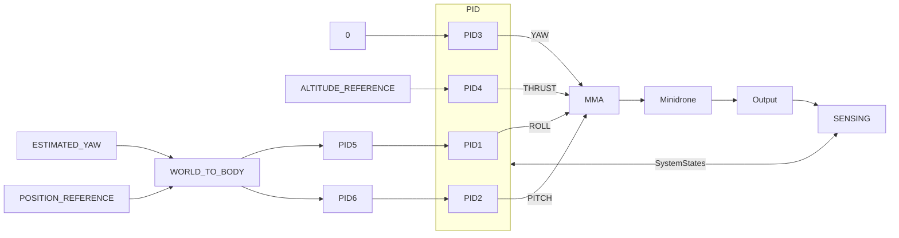

# Projeto de Controlador para Drone 2D
## Overview
O objetivo do projeto é a compreensão e aplicação de controladores para um modelo simplificado de quadricóptero que se move em duas dimensões. O escopo do problema inical é desenvolver um controlador de altitude que permita ao drone decolar e manter-se em hover em 5m do solo.

## Descrição do Sistema:
Estamos trabalhando com um sistema sub-atuado, ou seja, temos mais graus de liberdade do que atuadores. Isso significa que o movimento para algumas direções específicas não pode ser realizado de forma desacoplada. Em um modelo mais geral do que o utilizado, podemos ter alguma base dos algoritmos empregados para descrever o movimento do Drone em 3D.

Os movimentos 4 básicos de uma aeronave rotativa são divididos em Roll, Pitch, Yaw e Thrust. A combinação desses 4 movimentos garantem a movimentação em todas as direções necessárias para sua operação.


### Motor Mixing Algorithm
As entradas do sistema são as velocidades dos quatro astuadores. Utilizando esses dados, descrevemos os movimentos possíveis do drone com combinações diferentes de geração de força e torque no sistema com determinados atuadores. Assim,podemos chegar no algorimo a seguir para o controle de cada movimento de um jeito mais intuitivo. Ele é chamado de Motor Mixing Algorithm (MMA), e pode ser conferido abaixo:

$$Motor_{frontal-direito} = Thrust_{cmd} + Yaw_{cmd} + Pitch_{cmd} + Roll_{cmd} $$
$$Motor_{frontal-esquerdo} = Thrust_{cmd} - Yaw_{cmd} + Pitch_{cmd} - Roll_{cmd} $$
$$Motor_{traseiro-direito} = Thrust_{cmd} - Yaw_{cmd} -Pitch_{cmd}  + Roll_{cmd} $$
$$Motor_{traseiro-esquerdo} =Thrust_{cmd} + Yaw_{cmd} -Pitch_{cmd} - Roll_{cmd} $$

### Sistema em malha fechada 
Para garantir que o drone execute o hover em $5 m$ , precisamos construir um sistema em ```Feedback``` . Isso ocorre porque precisamos garantir que o sistema seja alimentado com dados sobre a altitude atual e que esses dados sejam comparados com uma altura de referência.

#### Controlador de Altitude
Para que o Drone se mantenha em Hover, precisamos garantir que o Voo seja nivelado. Caso contrário, a altitude pode estar em valor correto, mas com o Drone se afastandp da posição de referência em x ou em y.

### Posição de Referência
Para evitar que o Drone se afaste da posição inicial por causa de perturbações(rajadas, por exemplo), precisaremos de controladores de ângulos de Roll, Pitch e Yaw. Precisaremos, também, de um controlador específico de posição, que utiliza uma posição de referência como parâmetro. Isso ocorre porque um controlador que deixe os ângulos de Roll e Pitch fixados em 0°(para tentar garantir o voo nivelado) impede que o sistema faça mudanças de Roll e Pitch para corrigir os erros de posição inicial. O ângulo de Yaw também faz parte desse controlador, e atua como uma matriz de rotação, já que a referência de guinada é em um referencial inercial em solo.

### Arquitetura do Controlador
Vamos ilustrar o funcionamento do drone com um experimento mental. Supondo que o Drone esteja voando na altitude correta de $5m$, mas que esteja à esquerda da posição inicial(que vamos adotar como referência). Isso acusa um erro de posição e seu controlador solicita que o drone role para a direita. Esse sistema  se comunica com o MMA, que determina que os atuadores do lado esquerdo aumentem suas velocidades, e que os da direita, as diminuam. Assim, o drone se move para a direita. Mas o Drone, então, perde altitude. O controlador de altitude percebe o erro na altitude e aumenta o Thrust dos quatro motores. 

Vamos ilustar com um Diagrama de Blocos o que foi descrito anteriormente:


## Implementação
Um modelo simplificado dessa planta foi implementado em Simulink:


## Perda de Massa
Quando inputamos na planta um sistema que supõe a perda de massa no sistema, com os parãmetros restantes mantidos, o Drone continua seu Hover, mas em aproximadamente 7.5m. Isso faz sentido, já que os parâmetros de Controle são as velocidades dos rotores, então o equilíbrio do corpo por conta da sustentação, já com menos massa, acontece a uma altitude maior.
As figuras abaixo ilustram as modificações feitas no sistema:
### Entrada Degrau


### Configurações


## Referências Bilbiográficas

 - [Modelagem de Motores DC - Saulo da Paz Almeida](https://doc-00-1g-prod-02-apps-viewer.googleusercontent.com/viewer2/prod-02/pdf/usn95j7fpmmicbpeidtbnds409f01978/vollffg3qc2gsr4javi2umpb9saprvbo/1720517475000/3/108605637848060273413/APznzaZReAMit9l5ZMsInqhtCcwvp5m348bI6VeVC_s1GWayIXZouR3uNhTWV6tcO8NINWuuGpwrnwjaMpaQTtZW9AfPXnB4FeyQlTZL1AqjdAZIUarE0CBHmp8CHVEmSYCX_x-7QZTX4e5APw0HCbgzbPT35QerKwTdWFYyxlXud6fpLScMosfx98izQ97gAy3z5zMSz2vIYlxXmpUh6ZP87fOAyj_6VDss9IablygkxAgm_pNQkvX3p2oyEIAC6MO0-ph6hetW-C8zld_-9tMxlfP7htOKobXQsO_3r84XbkIGyS4lSPO65jOFBlXGcJ2uXCWy12aiBOSwhHMe1OpZZZ13kkfKgozsix0aQwy_h4VeUDx6FM-OuSirnHKXFQWTv1BqV29QCVyuWbVHNTPEB7MoaxiWdCQQkxyUEgZQrF9kbUGwzc8=?authuser=0&nonce=asnmgp77mrqta&user=108605637848060273413&hash=nscmvshi28oabt8f8al7ve4s64b13s35)
 - Bolton, William. Mechatronics: electronic control systems in mechanical and electrical
engineering. Pearson Education, 2003.
 - [Maxon UAV propulsion systems](https://www.maxongroup.net.au/medias/sys_master/root/8930376351774/210827-Brosch-UAV-2021-UG-PRINT.pdf . Acesso em 1 de junho de 2024.)
 - OGATA, K. Engenharia de Controle Moderno. 5. ed. São Paulo: Pearson, 2010.
 - [Controladores - Drone 2D - Saulo da Paz Almeida](https://doc-08-7g-prod-03-apps-viewer.googleusercontent.com/viewer2/prod-03/pdf/mprnna3hsbkv2i5tf837evej0501245p/qbenbqa157vku6bitqkqjj79cpasbb85/1720531350000/3/108605637848060273413/APznzaYJYH-F-W4mpyZ6oM3MpwsLlUsDvZDn11qkcoZP7MsZ81ebrxCpiDsGk4x2qfV8y3ZVD_sO5a3l5mxylNJWgDL8EciBHFPjrX7KT-Je-uJbV5PSHdGJ_XP1HYlQOsFCJn3vsh3Dfg1p3K3RM1GbmeQLUgYDcImLMITswqrP9_9JAROQcO1KjzLSQUK-6EUIYpfeQuvOmUyHsJ_AsXtnNA0DnqKj0y8WI9RaQM3HGDYEtMM5J326YrbkajCd6YZWybOsSaE32_wGo9Vr1NCajQqSVhGQO9jK7Rul8XdhLsXnedWhepSVjvPseH5mx2lQ9idRIOsdPdQklbKwxExj7wOKhk0TVjqoNdXKaa66H9q8SQlTFam_CjYqporJqZEtm_1BI3O79TbwGbWSBwP9LougvywtgIf-_AtRtrKoV-y363ok7Zc=?authuser=0&nonce=f4kgvle7a9nga&user=108605637848060273413&hash=n8sf1mq8u1tcl67ffn3ekdotfdqiuj6b)
 - Mellinger, Daniel, Nathan Michael, and Vijay Kumar. "Trajectory generation and control
for precise aggressive maneuvers with quadrotors." The International Journal of Robotics
Research 31.5 (2012): 664-674.
 -  MATLAB. Playlist “Drone simulation and Control”.
https://youtube.com/playlist?list=PLn8PRpmsu08oOLBVYYIwwN_nvuyUqEjrj&si=v3Dt74Kpx
87bq36R

- Bárbara Silva Francisco
- [@LorenzaBriz0t0](https://github.com/LorenzaBriz0t0) - Lorenza Costa Brizoto
- Lucas Henrique Muniz Branquinho

### SAA0160 - Sistemas de Controle de Aeronaves
## Docentes
- Glauco Augusto de Paula Caurin
- Saulo da Paz Almeida


